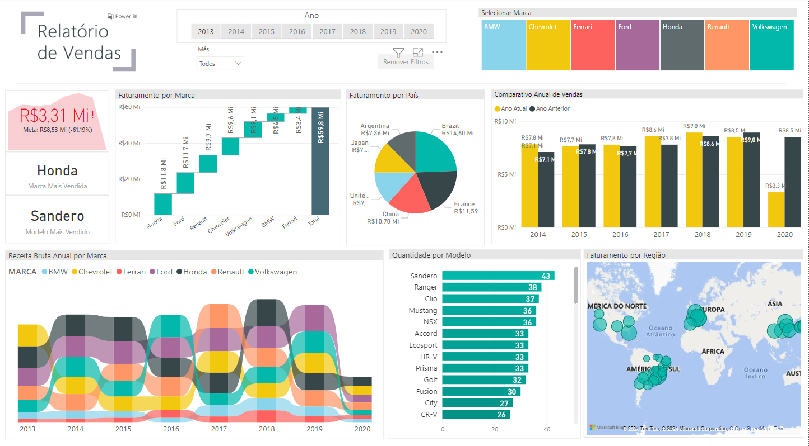
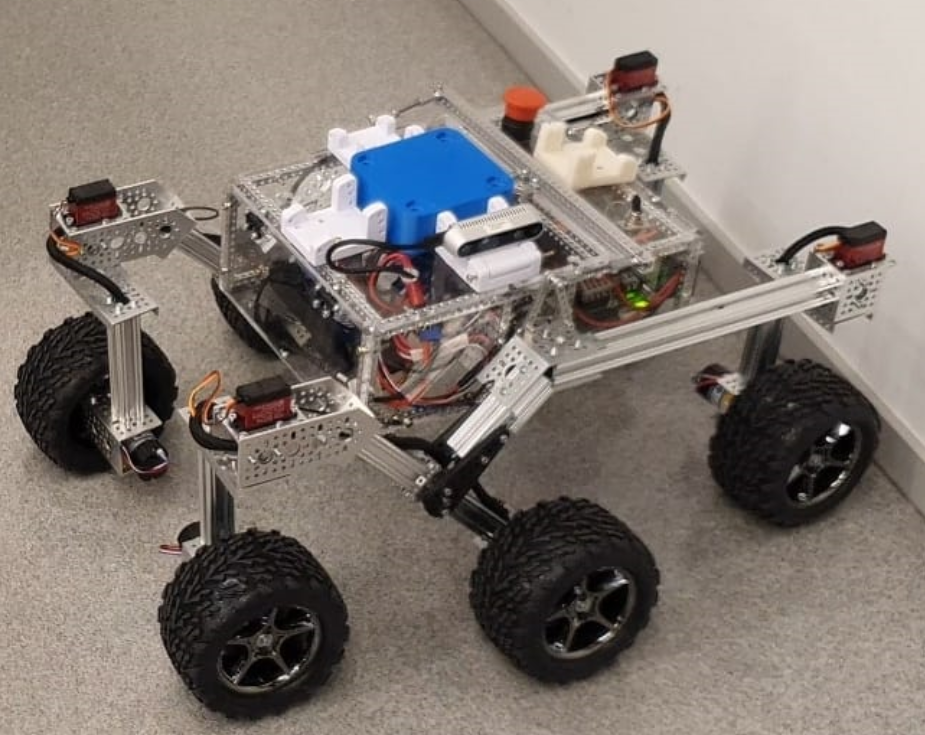
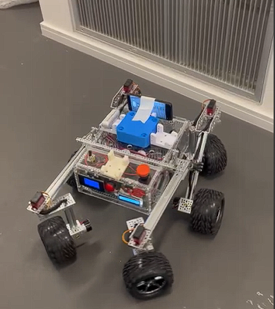

# Portfolio of Thomas Bekhor - July 2025

Welcome to my portfolio! I am a Mechatronics Engineer graduated from Insper Institute, São Paulo. This portfolio brings together some of the most significant projects I have developed throughout my academic and professional journey.

---

## Projects

### [Sales Dashboard with Power BI](https://github.com/FernandoBichuette/Portfolio/tree/main/PowerBI)

**Description:** This project involved the creation of an interactive sales dashboard using Power BI. The goal was to transform raw data into clear and informative visual insights, covering various sales metrics such as total revenue, regional performance, and trend analysis over time.

**Technologies Used:** Power BI, Data Visualization, Business Intelligence

**Challenges and Solutions:**

* **Data Transformation:** One of the main challenges was cleaning and preparing the data for analysis. Various transformations were applied to ensure data accuracy and consistency, including removing duplicates, handling null values, and formatting dates.
* **Creating Impactful Visuals:** Creating visuals that were both informative and visually appealing was essential. Using Power BI's advanced features, dynamic and interactive charts were developed to facilitate data understanding.
* **Report Automation:** Implementation of DAX functions to automate metric calculations and create reports that update automatically as data changes.

**Results:** The final dashboard provides a comprehensive view of sales, allowing users to explore data interactively and gain valuable insights into sales performance across regions and periods. This project demonstrated advanced skills in Power BI, including data manipulation and effective visualization creation.

---

### [Autonomous UGV Development](https://github.com/pfeinsper/unmaned-ground-vehicle-2024.1)

**Description:** Project in partnership with Embrapa for the development of an Unmanned Ground Vehicle (UGV) focused on monitoring aphids in fruit and forest crops.

**Technologies Used:** Python, Robotics and Automation, LIDAR Sensors, GPS, Sensor Fusion.

**Challenges and Solutions:**

* **Sensor Integration:** Overcome by implementing a sensor fusion system using Kalman filters.
* **Navigation Calibration:** Suspension adjustments and adaptive control algorithms for stability on rough terrain.
* **Energy Efficiency:** Optimized power management with solar panels and control software.
* **Data Communication:** Mesh network communication system for stable data transmission.

**Results:** Fully functional autonomous vehicle, field-tested, operating autonomously for extended periods.

     

---

### [Chess-Playing Robot](https://github.com/FernandoBichuette/Projeto-Xadrez.git)

**Period:** Aug 2023 – Dec 2023

**Description:** Development of a chess-playing robot that integrates computer vision and the Stockfish engine to interpret and respond to the opponent's moves.

**Technologies Used:** Python, Computer Vision, Image Processing, Stockfish.

**Challenges and Solutions:**

* **Piece and Position Detection:** Implementation of advanced image processing techniques for high accuracy.
* **Integration with Stockfish:** Synchronization between piece detection and the chess engine for automated moves.

**Results:** Robot capable of autonomously playing chess with a high level of accuracy.

  

---

### [Automatic Pipetting Machine](https://github.com/FernandoBichuette/Projeto-Mecatronico)

**Description:** Development of an automatic pipetting machine to optimize laboratory processes.

**Technologies Used:** Precision Mechanics, Integrated Electronics, Software Development.

**Challenges and Solutions:**

* **Mechanical Sizing:** Precise calculations and adjustments during the prototyping phase.
* **Electronic Integration:** Synchronization between mechanical and electronic components for precise operation.

**Results:** Functional prototype that improves efficiency and accuracy in pipetting processes.

     

---

### [Assembly Line Automation](https://github.com/FernandoBichuette/automation_project)

**Description:** Project focused on optimizing an electronic device assembly line using the Automation Pyramid and the creation of a Digital Twin.

**Technologies Used:** PLCs, SCADA, MES, Digital Twin.

**Challenges and Solutions:**

* **Control System Integration:** Development of solutions for efficient communication between different automation levels.
* **Digital Twin Creation:** Accurate simulation of the assembly line to optimize processes.

**Results:** Efficient automation system with monitoring and control of availability, performance, and quality.

***Final result link:*** [https://www.youtube.com/watch?v=bG43Epv7mO8](https://www.youtube.com/watch?v=bG43Epv7mO8)

---

### [Real Estate Market Analysis and Predictive Modeling](https://github.com/arthurfc12/Projeto3CDados)

**Description:** Exploratory analysis and predictive modeling of São Paulo’s real estate market using Machine Learning techniques.

**Technologies Used:** Python, Random Forest, Data Analysis.

**Challenges and Solutions:**

* **Data Segmentation:** Careful data analysis to identify patterns and create an efficient predictive model.
* **Model Selection:** Implementation and validation of different machine learning models to optimize results.

**Results:** Efficient predictive model providing valuable insights into São Paulo’s real estate market dynamics.

---

## Contact

* [LinkedIn](https://www.linkedin.com/in/fernando-bichuette-assumpcao/)
* [GitHub](https://github.com/FernandoBichuette)
