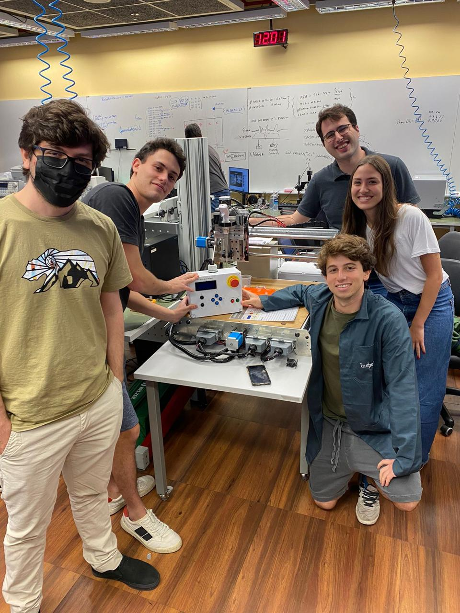
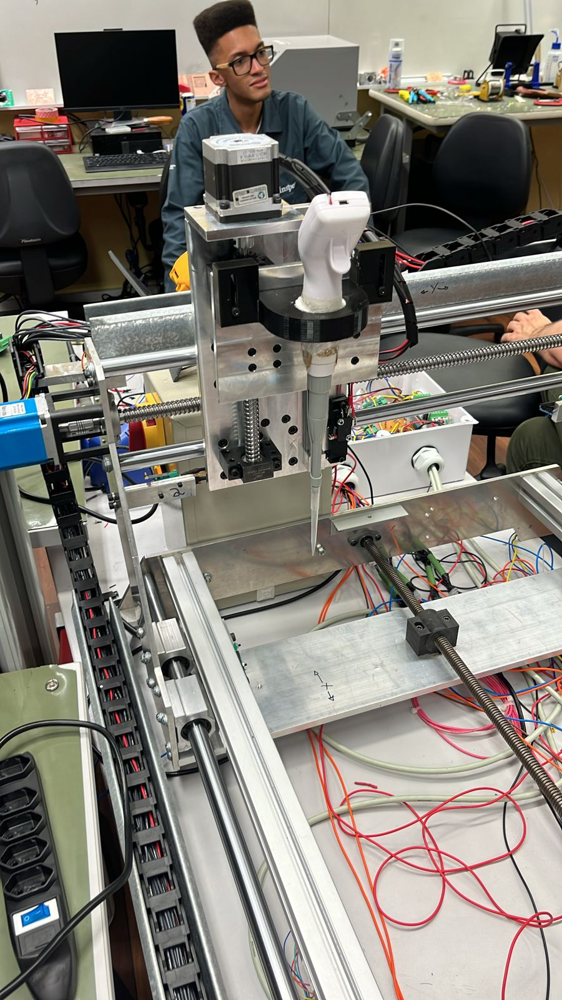

# Portfolio of Thomas Bekhor - updated in July 2025

Welcome to my portfolio! I am a Mechatronics Engineer graduated from Insper Institute, São Paulo. This portfolio brings together some of the most significant projects I have developed throughout my academic and professional journey.

---

## Projects

### [Chess-Playing Robot - December 2023](https://github.com/FernandoBichuette/Projeto-Xadrez.git)

**Description:** Development of a chess-playing robot that integrates computer vision and the Stockfish engine to interpret and respond to the opponent's moves.

**Technologies Used:** Python, Computer Vision, Image Processing, Stockfish, UR Robots.

**Challenges and Solutions:**

* **Piece and Position Detection:** Implementation of advanced image processing techniques for high accuracy.
* **Integration with Stockfish:** Synchronization between piece detection and the chess engine for automated moves.

**Results:** Robot capable of autonomously playing chess with a high level of accuracy.

  

---

### [Automatic Pipetting Machine - December 2022](https://github.com/thomasbekhor/Electronic-Pipetting-System)

**Description:** Development of an automatic pipetting machine to optimize laboratory processes.

**Technologies Used:** Precision Mechanics, Integrated Electronics, Software Development.

**Challenges and Solutions:**

* **Mechanical Sizing:** Precise calculations and adjustments during the prototyping phase.
* **Electronic Integration:** Synchronization between mechanical and electronic components for precise operation.

**Results:** Functional prototype that improves efficiency and accuracy in pipetting processes.

***Final result link:*** [https://youtu.be/ghOscyaO3Fg](https://youtu.be/ghOscyaO3Fg)

     

---

### Assembly Line Automation - July 2023

**Description:** Project focused on optimizing an electronic device assembly line using the Automation Pyramid and the creation of a Digital Twin.

**Technologies Used:** PLCs, SCADA, MES, Digital Twin.

**Challenges and Solutions:**

* **Control System Integration:** Development of solutions for efficient communication between different automation levels.
* **Digital Twin Creation:** Accurate simulation of the assembly line to optimize processes.

**Results:** Efficient automation system with monitoring and control of availability, performance, and quality.

***Final result link:*** [https://youtu.be/Q_xVt77PHuE](https://youtu.be/Q_xVt77PHuE)

---

### [Junior Consulting Club - Exploratory Analysis and Predictive Modeling - December 2022](https://github.com/thomasbekhor/Exploratory-and-Predictive-Analysis)

**Description:**
This project focuses on understanding and predicting property prices in São Paulo through **exploratory data analysis** and **machine learning**. The main goal is to extract insights from real estate data and build models that can forecast property values effectively.

**Technologies Used:**
Python, Pandas, Scikit-learn, Random Forest, Data Visualization

**Challenges and Solutions:**

* **Data Segmentation:** Divided and analyzed the dataset by key variables (e.g., neighborhood, size, price range) to identify trends and improve model performance.
* **Model Selection:** Tested multiple machine learning models, comparing their accuracy and interpretability. Chose Random Forest for its balance between performance and robustness.

**Results:**
The final model accurately predicts housing prices and reveals valuable patterns in São Paulo’s real estate market, supporting better decision-making for buyers, sellers, or investors.

---

## Contact

* [LinkedIn](https://www.linkedin.com/in/thomas-bekhor/)
* [GitHub](https://github.com/thomasbekhor)
